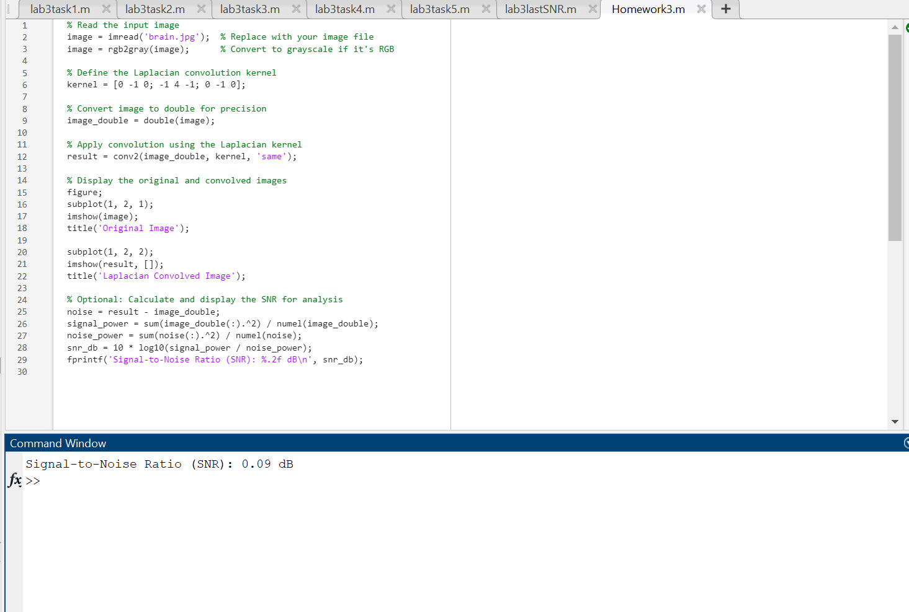

📁 BMED469 - Biomedical Image Processing - Lab Homework 3
This repository contains the MATLAB implementation of Lab Homework 3 from the BMED469 Biomedical Image Processing course. The task involves performing image convolution using a custom kernel (Laplacian filter) and calculating the Signal-to-Noise Ratio (SNR).

📌 Objective
Apply a different convolution kernel (Laplacian) to an image.

Perform edge detection and enhancement.

Calculate and report the Signal-to-Noise Ratio (SNR).

Display original and processed images.

🧠 Input Image
The brain.jpg image is used as the base for all image processing tasks.

📷 Screenshots
MATLAB Code Window

MATLAB Output Figures

🧪 Files in This Repository
File Name	Description
brain.jpg	Input grayscale image used in the task
Homework3.m	MATLAB script performing convolution
ScreenshotCodeHW3.png	Screenshot of the code in MATLAB editor
Screenshot.png	Screenshot of MATLAB output/figure windows

▶️ How to Run
Make sure all files are in the same folder.

Open MATLAB.

Navigate to the folder containing the files.

Run the script:

matlab
Copy
Edit
Homework3
This will:

Read the input image.

Apply the Laplacian convolution.

Display the original and filtered images.

Print the calculated SNR in the command window.

✅ Output Example
The convolved image highlights edges and transitions in the original image.

SNR (Signal-to-Noise Ratio) value will be printed in dB for analysis.

🔧 Requirements
MATLAB R2018a or newer (any version with conv2, imshow, and image processing support).

📚 License
This repository is intended for educational purposes as part of BMED469 coursework.
